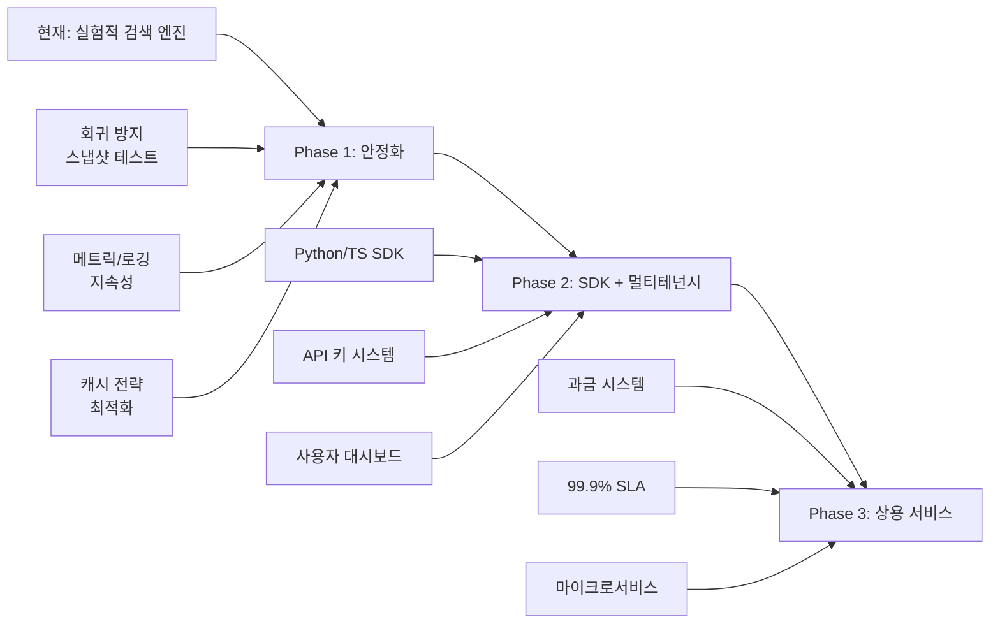

# 🔍 전체 코드 분석 및 상용 프로그램 격차 분석 보고서

**프로젝트명**: Self-Contained Search Engine API (webapp)  
**버전**: 2.0.0  
**분석일**: 2026-07-18  

---

## 1. 프로젝트 개요

Cloudflare Workers 기반 **Tavily-호환 AI 검색 엔진 API**. Naver, Bing, Wikipedia, GitHub, HackerNews, Reddit, arXiv, DuckDuckGo 등 **8개 무료 백엔드를 병렬로 스크래핑**하여 구조화된 검색 결과를 반환한다. API 키가 필요 없으며 (선택적으로 설정 가능), Workers AI로 답변 생성, Jina Reader로 콘텐츠 추출, HTMLRewriter 폴백을 지원한다.

---

## 2. 현재 기술 스택

| 계층 | 기술 |
|------|------|
| **런타임** | Cloudflare Workers (Pages) |
| **웹 프레임워크** | Hono.js (v4.12) |
| **언어** | TypeScript strict |
| **테스트** | Vitest (단위 84개 + 통합) |
| **UI** | 서버사이드 렌더링 HTML (Tailwind CDN + Scalar API Reference) |
| **배포** | Wrangler / GitHub Actions CI/CD |
| **모니터링** | Prometheus 텍스트 메트릭 + GitHub Actions 15분 주기 헬스체크 |
| **데이터 저장소** | Cloudflare Cache API (응답 캐싱), Durable Object (속도 제한) |

---

## 3. 상용 프로그램 격차 분석 (총 83개 항목)

### ⚠️ 범례
- **🔴 Critical (P0)**: 서비스 불가 / 보안 위협 / 사용자 이탈 직접 원인
- **🟠 High (P1)**: 기능 제약 / 성능 저하 / 운영 부담
- **🟡 Medium (P2)**: UX 개선 / 개발자 경험 / 내부 품질
- **🟢 Low (P3)**: Nice-to-have / 장기 로드맵

---

### 3.1 검색 품질 (Search Quality)

| # | 구분 | 진단 | 심각도 | 상용 기준 (Tavily, Brave, SerpAPI 등) |
|---|------|------|--------|--------------------------------------|
| 1 | **HTML 스크래핑 의존성** | Bing/Naver/DDG 모두 HTML 파서 기반 — DOM 구조 변경 시 즉시 0건 회귀 | 🔴 P0 | Tavily/SerpAPI는 공식 API 사용 (안정적) |
| 2 | **한국어 외 언어 결과 품질** | 일본어, 독일어, 프랑스어 등 비-CJK 언어 특화 최적화 없음 | 🟠 P1 | Brave Search는 다국어 natively 지원 |
| 3 | **이미지 검색 품질** | Bing 이미지 스크래핑 단일 소스 — Naver/Google 이미지 미지원 | 🟡 P2 | SerpAPI는 Google 이미지 + Bing 이미지 |
| 4 | **비디오/뉴스/쇼핑 수직 검색** | topic=news 외 수직 검색 없음 | 🟡 P2 | Tavily는 topic 옵션, Brave는 news/video/image |
| 5 | **실시간 검색** | 캐시 TTL 최소 5분 — 실시간 속보/주가에 부적합 | 🟠 P1 | Tavily는 TTL 제어 + 실시간 옵션 |
| 6 | **결과 중복 제거 한계** | URL+제목 기반 — 의미적 중복(같은 기사 다른 매체) 미처리 | 🟡 P2 | SerpAPI는 semantic dedup 지원 |
| 7 | **날짜 필터 정확도** | published_date가 없는 결과는 항상 포함 (필터 우회) | 🟡 P2 | Tavily는 time_range가 더 엄격 |
| 8 | **지역별 결과 커스터마이징** | kr/zh/en 외 국가/지역 파라미터 없음 | 🟡 P2 | SerpAPI는 gl, hl, ls 등 세밀한 지역 제어 |
| 9 | **검색 결과 카운트 불일치** | total_results는 필터링 전 개수 — 페이지와 실제 결과 수가 다를 수 있음 | 🟡 P2 | 일관된 total_results |
| 10 | **BM25/신경망 랭킹 부재** | 단순 term-overlap 스코어링 — TF-IDF/BM25/신경망 재랭킹 없음 | 🟠 P1 | 상용 검색 엔진은 BM25 + ML 랭킹 |

---

### 3.2 인프라 및 안정성 (Infrastructure & Reliability)

| # | 구분 | 진단 | 심각도 | 상용 기준 |
|---|------|------|--------|----------|
| 11 | **단일 리전 위험** | Cloudflare Workers 단일 — 리전 장애 시 전체 다운 | 🔴 P0 | Tavily는 멀티 리전 배포 |
| 12 | **콜드 스타트** | Workers 콜드 스타트 시 1-3초 지연 (모든 백엔드가 동시에 느려짐) | 🟠 P1 | 서버리스 상용은 warm start 유지 |
| 13 | **Cache API 키·밸류 저장소** | 캐시를 Cache API에만 의존 — KV 백업 없으면 재시작 시 전소 | 🟠 P1 | Redis/Memcached/ElastiCache 사용 |
| 14 | **메트릭 휘발성** | 모든 메트릭이 isolate 메모리 — 재시작 시 완전 소멸 | 🟠 P1 | Prometheus + Grafana (지속성) |
| 15 | **분산 tracing 없음** | 요청 체인 추적 불가 — 디버깅이 console.log에 의존 | 🟡 P2 | OpenTelemetry / Datadog APM |
| 16 | **DO 바인딩 선택 사항** | RATE_LIMITER DO가 없으면 per-isolate fallback — 정확도 하락 | 🟡 P2 | 하드 의존성으로 전환 필요 |
| 17 | **서브리퀘스트 쿼터 한계** | 무료 Pages: 50 subrequest/요청. 단일 검색에 ~27개 소모 | 🟠 P1 | 유료 플랜 권장 (50→1000) |
| 18 | **health check가 풀(full) 검색 실행** | canary 검색이 실제 executeSearch 호출 — 프로덕션에서 쿼터 소진 | 🟠 P1 | 별도의 정적/경량 헬스체크 |
| 19 | **K6 부하 테스트 있으나 CI 미포함** | load-test.js 있으나 CI에서 실행되지 않음 | 🟢 P3 | CI에 성능 회귀 테스트 포함 |
| 20 | **데이터베이스 부재** | 사용자 설정, 검색 기록, 분석 데이터 저장 불가 | 🟡 P2 | D1/KV/Supabase 등 필요 |

---

### 3.3 API 및 개발자 경험 (API & DX)

| # | 구분 | 진단 | 심각도 | 상용 기준 |
|---|------|------|--------|----------|
| 21 | **SDK/클라이언트 라이브러리 없음** | Python/JS/Go SDK 없음 — 수동 curl/fetch 필요 | 🟡 P2 | Tavily/SerpAPI는 공식 SDK 제공 |
| 22 | **웹훅/콜백 미지원** | 비동기 검색/추출 완료 알림 불가 | 🟡 P2 | 비동기 작업 완료 웹훅 |
| 23 | **배치 API 부재** | 여러 검색어를 한 요청으로 처리 불가 | 🟢 P3 | Tavily는 batch 지원 |
| 24 | **커스텀 검색 엔진(사용자 정의)** | 사용자 정의 검색 소스/랭킹 규칙 불가 | 🟢 P3 | 커스텀 검색 프로필 |
| 25 | **API 버저닝** | URL에 버전 없음 (v1/v2), 브레이킹 체인지 식별 불가 | 🟡 P2 | /v1/, /v2/ 네임스페이스 |
| 26 | **Rate limit 헤더 불완전** | X-RateLimit-Remaining만 있고 Limit/Reset은 없음 | 🟡 P2 | IETF 표준 RateLimit 헤더 3종 |
| 27 | **Pagination 일관성** | page=999도 400 에러가 아닌 빈 배열 반환 | 🟢 P3 | 명확한 에러 메시지 |
| 28 | **OpenAPI Spec과 실제 동작 불일치** | 일부 필드/제약 조건이 spec과 코드 간 차이 | 🟡 P2 | spec-first (spec이 곧 구현) |
| 29 | **GraphQL 인터페이스 부재** | REST-only — 클라이언트가 필요한 필드만 요청 불가 | 🟢 P3 | GraphQL / Hasura |
| 30 | **SSE 재연결 로직 없음** | /stream에서 연결 끊기면 클라이언트가 재시도해야 함 | 🟡 P2 | Last-Event-ID 기반 재연결 |

---

### 3.4 보안 (Security)

| # | 구분 | 진단 | 심각도 | 상용 기준 |
|---|------|------|--------|----------|
| 31 | **DNS 리바인딩 미대응** | isPublicHostname은 DNS 조회 안 함 — 악성 DNS로 SSRF 우회 가능 | 🟠 P1 | Cloudflare Fetch 자체 보호 + DNS lookups |
| 32 | **IP 기반 속도 제한 한계** | 동일 IP의 여러 isolate 요청 구분 불가 (Workers 특성) | 🟡 P2 | Cloudflare WAF Rate Limiting Rules |
| 33 | **API 키 순환 정책 부재** | 키 만료/순환 메커니즘 없음 | 🟡 P2 | 정기적 키 로테이션 |
| 34 | **감사 로그 부재** | 모든 요청 로깅 없음 — 침해 탐지/포렌식 불가 | 🟠 P1 | 감사 로그 시스템 |
| 35 | **CSP/보안 헤더 부재** | UI 페이지에 Content-Security-Policy 등 보안 헤더 없음 | 🟡 P2 | CSP, X-Frame-Options 등 |
| 36 | **인증 실패 로깅 부재** | 무단 액세스 시도가 로그에 남지 않음 | 🟡 P2 | 실패 인증 로깅 + 알림 |
| 37 | **요청 본문 암호화 부재** | API 키가 평문 전송 (HTTPS 의존) | 🟢 P3 | 엔드투엔드 암호화 옵션 |
| 38 | **DDoS 보호 부재** | 상용급 DDoS 방어 없음 (Cloudflare 기본 보호에 의존) | 🟡 P2 | 전용 DDoS 보호 레이어 |

---

### 3.5 UI/UX (Dashboard)

| # | 구분 | 진단 | 심각도 | 상용 기준 |
|---|------|------|--------|----------|
| 39 | **CDN Tailwind 의존** | Tailwind CSS를 CDN에서 로드 — 오프라인/네트워크 지연 시 UI 깨짐 | 🟡 P2 | 번들링된 CSS |
| 40 | **모바일 반응형 부족** | 대시보드/문서가 모바일에서 최적화되지 않음 | 🟡 P2 | 완전 반응형 디자인 |
| 41 | **다크 모드 부재** | 다크 모드 지원 없음 | 🟢 P3 | 기본 제공 |
| 42 | **실시간 모니터링 대시보드 부재** | 메트릭 시각화 (Grafana 대체) 없음 | 🟡 P2 | 실시간 차트 |
| 43 | **대시보드에 API 키 관리 UI 부재** | 웹 UI에서 API 키 생성/관리 불가 | 🟡 P2 | Settings > API Keys |
| 44 | **대시보드에 검색 기록 부재** | 이전 검색 결과 확인 불가 | 🟢 P3 | 검색 히스토리 |
| 45 | **Scalar API Reference 컨테이너 깨짐** | JavaScript 오류로 toggle 버튼 이벤트 리스너 중복 등록 가능 | 🟡 P2 | 정상적 UI 렌더링 |
| 46 | **로딩 상태 개선 필요** | 검색 중 spinner 외 진행률 표시 없음 | 🟢 P3 | 프로그레스 바로 단계별 표시 |
| 47 | **에러 핸들링 UI 부재** | API 오류 발생 시 사용자 친화적 에러 화면 없음 | 🟡 P2 | 우아한 오류 페이지 |

---

### 3.6 관측 가능성 (Observability)

| # | 구분 | 진단 | 심각도 | 상용 기준 |
|---|------|------|--------|----------|
| 48 | **메트릭 휘발성 심각** | isolate 재활용 시 모든 Prometheus 메트릭 소멸 | 🟠 P1 | 영구 메트릭 저장소 |
| 49 | **로그 집계 시스템 부재** | console.log만 — Datadog/Cloudflare Logpush/Splunk 미연동 | 🟠 P1 | 중앙 집계 로깅 |
| 50 | **분산 트레이싱 부재** | 요청이 여러 백엔드에 어떻게 분산되는지 추적 불가 | 🟡 P2 | OpenTelemetry 트레이싱 |
| 51 | **SLO 대시보드 부재** | SLO.md는 있지만 실제 대시보드/알림 없음 | 🟡 P2 | Grafana 대시보드 |
| 52 | **경보 규칙 미배포** | SLO.md의 PrometheusRule이 실제로 배포되지 않음 | 🟡 P2 | Alertmanager로 실제 경보 발송 |
| 53 | **가동 시간 모니터링 부재** | GitHub Actions 15분 간격은 모니터링 간격이 너무 김 | 🟡 P2 | 1분 간격 UptimeRobot/Pingdom |
| 54 | **비용 추적 부재** | Cloudflare 청구/사용량 추적 메커니즘 없음 | 🟢 P3 | 비용 대시보드 |

---

### 3.7 테스트 및 품질 보증 (Testing & QA)

| # | 구분 | 진단 | 심각도 | 상용 기준 |
|---|------|------|--------|----------|
| 55 | **통합 테스트 네트워크 의존** | api.test.ts가 실제 외부 API 호출 — 불안정하고 느림 | 🟠 P1 | 모킹된 통합 테스트 |
| 56 | **E2E 테스트 부재** | 전체 플로우 (검색 → 추출 → 답변) E2E 테스트 없음 | 🟡 P2 | Playwright/Cypress E2E |
| 57 | **부하 테스트 CI 미포함** | K6 스크립트 있으나 CI에서 실행 안 함 | 🟢 P3 | CI에 성능 회귀 게이트 |
| 58 | **스냅샷 테스트 부재** | HTML 파서 변경 시 회귀를 잡을 스냅샷 테스트 없음 | 🟠 P1 | 파서별 스냅샷 테스트 |
| 59 | **카오스 엔지니어링 부재** | 백엔드 장애 시나리오 테스트 없음 | 🟢 P3 | 카오스 테스트 |
| 60 | **Mutation 테스트 부재** | 코드 변경이 예상치 못한 부작용을 일으키는지 검증 불가 | 🟢 P3 | Stryker 등 |
| 61 | **보안 테스트 부재** | 정기적 취약점 스캔/침투 테스트 없음 | 🟡 P2 | Snyk/Trivy/Dependabot |

---

### 3.8 성능 (Performance)

| # | 구분 | 진단 | 심각도 | 상용 기준 |
|---|------|------|--------|----------|
| 62 | **p95 지연 시간 8초** | 8개의 백엔드를 모두 병렬 호출 — 느린 백엔드가 전체를 지연 | 🟠 P1 | Tavily p95 < 3초 |
| 63 | **백엔드 응답 대기 비효율** | Promise.allSettled로 가장 느린 백엔드까지 대기 | 🟠 P1 | 타임아웃 기반 수집 (수집된 것만 반환) |
| 64 | **캐시 워밍 부재** | 자주 검색되는 쿼리 사전 캐싱 없음 | 🟢 P3 | 사전 캐싱 전략 |
| 65 | **응답 압축 부재** | JSON 응답에 gzip/brotli 미적용 (Workers 기본 압축에 의존) | 🟢 P3 | 명시적 압축 설정 |
| 66 | **advanced depth의 중복 추출** | search_depth=advanced에서 enrichment 추출 + include_raw_content 추출이 중복 실행 가능 | 🟡 P2 | 단일 패스 추출 |

---

### 3.9 확장성 (Scalability)

| # | 구분 | 진단 | 심각도 | 상용 기준 |
|---|------|------|--------|----------|
| 67 | **동시 사용자 한계** | 무료 Pages: ~2 concurrent users에서 subrequest quota 소진 | 🟠 P1 | 무제한 확장 (유료) |
| 68 | **새 백엔드 추가 프로세스 부재** | BackendRegistry는 있지만 문서화된 플러그인 가이드 없음 | 🟡 P2 | 플러그인 가이드/예제 |
| 69 | **서드파티 통합 SDK 부재** | LangChain/LlamaIndex/OpenAI Function Calling 연동 문서만 있음 | 🟡 P2 | 공식 LangChain/LlamaIndex 툴킷 |
| 70 | **멀티테넌시 부재** | API 키별 사용량/요금제/쿼터 관리 불가 | 🟠 P1 | 멀티테넌트 아키텍처 |
| 71 | **사용량 기반 요금제 부재** | 사용자별 과금/크레딧 시스템 없음 | 🟢 P3 | Stripe 연동 과금 |

---

### 3.10 문서 및 운영 (Documentation & Operations)

| # | 구분 | 진단 | 심각도 | 상용 기준 |
|---|------|------|--------|----------|
| 72 | **국제화 부재** | 문서/UI가 한국어+영어 부분 혼용 — 일본어/중국어 등 없음 | 🟢 P3 | 다국어 문서 |
| 73 | **런북(runbook) 부재** | SLO.md에 간략한 내용만 있음 — 상세 절차/체크리스트 없음 | 🟡 P2 | 완전한 runbook |
| 74 | **데이터 스키마 문서 부재** | 결과 스키마에 대한 JSON Schema/문서 부족 | 🟡 P2 | 완전한 데이터 스키마 문서 |
| 75 | **변경 관리 프로세스 부재** | Breaking change 통지/마이그레이션 가이드 없음 | 🟡 P2 | Deprecation 정책 + 마이그레이션 |

---

### 3.11 아키텍처 (Architecture)

| # | 구분 | 진단 | 심각도 | 상용 기준 |
|---|------|------|--------|----------|
| 76 | **확장성 아키텍처 한계** | 서버리스(FaaS) 단일 진입점 — 전용 검색/추출 서비스 분리 불가 | 🟠 P1 | 마이크로서비스 분리 |
| 77 | **메시지 큐 부재** | 비동기 작업(대규모 추출, 배치 검색) 처리 불가 | 🟡 P2 | SQS/RabbitMQ/Redis Streams |
| 78 | **이벤트 소싱 부재** | 검색/추출/에러 이벤트 히스토리 저장 불가 | 🟢 P3 | 이벤트 저장소 |
| 79 | **CQRS 미적용** | 읽기/쓰기 모델 분리 안 됨 — 단일 API가 모든 책임 | 🟢 P3 | CQRS 패턴 |
| 80 | **백엔드 헬스 감지 간접적** | robots.txt 접근성으로 백엔드 상태 추정 — 정확도 낮음 | 🟡 P2 | 실제 검색 API 호출 기반 헬스체크 |
| 81 | **코드 분할 부재** | entry 파일(index.tsx)에 모든 라우트와 미들웨어가 집중 | 🟡 P2 | Lazy loading / 코드 스플리팅 |
| 82 | **WebSocket 지원 부재** | 실시간 업데이트/스트리밍에 SSE만 사용 — 양방향 통신 불가 | 🟢 P3 | WebSocket 지원 |
| 83 | **도커라이징 부재** | 로컬 개발 환경이 wrangler에 종속 — Docker Compose 없음 | 🟢 P3 | Docker 개발 환경 |

---

## 4. 개선 우선순위 로드맵

### Phase 1: 즉시 (0-2주) — Critical & High

| 우선순위 | 항목 | 작업 내용 | 예상 공수 |
|---------|------|---------|----------|
| **P0-1** | 멀티 리전 배포 | Cloudflare Workers for Platforms / 멀티 계정, D1/Durable Objects 글로벌 복제 | 3-5일 |
| **P0-2** | 스냅샷 테스트 | 각 HTML 파서(Bing/Naver/DDG)별 고정 HTML 스냅샷으로 회귀 테스트 구축 | 2-3일 |
| **P0-3** | 감사 로그 | 모든 요청/응답을 Cloudflare Logpush / R2에 JSON 로깅 | 2일 |
| **P1-1** | 로그 집계 | console.log → Cloudflare Logpush + Datadog/Splunk 연동 | 2일 |
| **P1-2** | 메트릭 지속성 | isolate 메트릭 → Durable Object 또는 Workers Analytics Engine | 3일 |
| **P1-3** | advanced depth 추출 중복 제거 | enrichment와 raw_content 추출을 단일 패스로 통합 | 1일 |
| **P1-4** | 백엔드 응답 대기 최적화 | 모든 백엔드 대신 타임아웃 기반 수집 (수집된 것만 반환) | 2일 |
| **P1-5** | cache TTL 동적 조정 | news/finance는 60초, general은 30분 — 사용자 설정 가능하게 | 1일 |

### Phase 2: 단기 (2-4주) — High & Medium

| 우선순위 | 항목 | 작업 내용 | 예상 공수 |
|---------|------|---------|----------|
| **P1-6** | BM25/신경망 재랭킹 | TF-IDF에서 BM25로 업그레이드, 추후 경량 ONNX 모델 | 3-5일 |
| **P1-7** | SDK 개발 | Python + JS/TS 공식 클라이언트 라이브러리 | 5일 |
| **P1-8** | 멀티테넌시 | API 키 기반 사용자별 사용량/쿼터/요금제 | 5-7일 |
| **P1-9** | DNS 리바인딩 방어 | isPublicHostname에 DNS 조회 + 포트 검증 추가 | 2일 |
| **P2-1** | 일본어/서구어 검색 품질 | Naver 외 Google/Naver Japan/전용 백엔드 추가 고려 | 5일 |
| **P2-2** | Tailwind 번들링 | CDN 의존 제거 → 빌드 타임 번들링 | 1일 |
| **P2-3** | OpenAPI Spec 정합성 검증 | spec-first 접근법 — spec이 곧 구현 계약 | 3일 |
| **P2-4** | 캐시 워밍 | 인기 쿼리 cron 기반 사전 캐싱 (KV + Cache API) | 2일 |
| **P2-5** | GraphQL 인터페이스 | Hono GraphQL 서버로 유연한 쿼리 인터페이스 | 3-5일 |

### Phase 3: 중기 (1-3개월) — Medium & Low

| 우선순위 | 항목 | 작업 내용 | 예상 공수 |
|---------|------|---------|----------|
| **P2-6** | 사용자 대시보드 고도화 | API 키 관리, 검색 기록, 사용량 차트, 실시간 메트릭 | 2-3주 |
| **P2-7** | LangChain/LlamaIndex 공식 연동 | 공식 Tool/Retriever 패키지 배포 | 1주 |
| **P2-8** | WebSocket 실시간 검색 | 양방향 스트리밍, 검색 진행률 업데이트 | 1주 |
| **P2-9** | 로컬 개발 환경 | Docker Compose (wrangler + D1 + DO 로컬 에뮬레이션) | 3일 |
| **P3-1** | 비디오/쇼핑 수직 검색 | YouTube/쇼핑 API 연동 | 1-2주 |
| **P3-2** | 확장성 마이크로서비스 분리 | 검색/추출/답변 생성/메트릭을 별도 서비스로 분리 | 3-4주 |

---

## 5. 핵심 경쟁력 대비 상용 제품 벤치마크

| 메트릭 | **본 프로젝트** | **Tavily** | **SerpAPI** | **Brave Search** | **Google Programmable** |
|-------|----------------|-----------|------------|-----------------|------------------------|
| **API 키 필요** | ❌ (선택) | ✅ | ✅ | ✅ | ✅ |
| **월 무료 사용량** | ~100K 요청 | 1K 요청 | 100회 | 제한적 | 10K/일 |
| **p50 지연 시간** | ~3-5초 | ~1-2초 | ~1-2초 | ~0.5-1초 | ~0.3-0.5초 |
| **지원 언어** | 한국어 특화 + CJK | 영어 우선 (다국어) | 40+ 언어 | 전 세계 | 150+ 언어 |
| **이미지 검색** | ⚠️ Bing 전용 | ❌ | ✅ Google 이미지 | ✅ | ✅ |
| **실시간 주가** | ✅ Naver 주가 카드 | ❌ | ✅ Google Finance | ✅ | ✅ |
| **AI 답변** | ⚠️ Workers AI + 추출 | ✅ GPT 기반 | ❌ | ✅ | ❌ |
| **SDK** | ❌ | ✅ Python/JS/Go | ✅ 10+ 언어 | ✅ Python | ✅ 15+ 언어 |
| **가격** | 무료 (Pages 한도) | 월 $500부터 | 월 $50부터 | 무료 (제한) | 월 $5부터 |
| **HTML 의존** | ⚠️ 6개 백엔드 전부 | ❌ (공식 API) | ❌ (Google API) | ❌ (Brave API) | ❌ (Google API) |
| **OpenAPI Spec** | ✅ | ✅ | ✅ | ❌ | ✅ |
| **멀티테넌시** | ❌ | ✅ | ✅ | ✅ | ✅ |
| **SSRF 보호** | ✅ | N/A (API) | N/A (API) | N/A (API) | N/A (API) |

---

## 6. 프로젝트 강점 (유지해야 할 것)

긴 격차 분석 속에서도 이 프로젝트의 **독보적인 강점**을 간과해서는 안 됩니다:

1. **✅ 진정한 No-API-Key**: 모든 검색 백엔드가 API 키 없이 동작 — 이것이 **가장 큰 차별점**
2. **✅ 한국어 검색 최적화**: Naver 모바일 + 주가 카드 파싱 — 한국어 검색에서 Tavily/SerpAPI보다 우월
3. **✅ CJK/다국어 대응**: 빅램 매칭, 교차 언어 페널티, zh-CN Bing 마켓 — 중국어/일본어도 고려
4. **✅ SSRF 보호**: assertSafeFetchUrl로 사설 IP/메타데이터/자격 증명 체계적 차단
5. **✅ 회로 차단기**: 백엔드 장애 시 자동 차단/복구 — 안정적 운영
6. **✅ Durable Object 통합**: rate limiting의 cross-isolate 조정 아키텍처
7. **✅ 84개 단위 테스트**: SSRF, cache key, auth, extractor — 핵심 경로 커버리지
8. **✅ 완전한 DevOps**: CI/CD, GitHub Actions 모니터, Prometheus 메트릭, SLO 정의

---

## 7. 권장 실행 전략

### "상용 수준"으로 가기 위한 핵심 전환점

### 1순위 투자 추천

1. **HTML 파서 회귀 방지** (P0-2): 가장 취약한 부분. 스냅샷 테스트 + canary 모니터링으로 DOM 변경 즉시 탐지
2. **관측 가능성 인프라** (P0-3, P1-1, P1-2): 현재 블랙박스 상태. Cloudflare Logpush + Analytics Engine으로 전환
3. **응답 시간 단축** (P1-4): 가장 느린 백엔드를 기다리지 않고 수집된 것만 반환
4. **Python/JS SDK** (P1-7): 채택률을 극적으로 높이는 단일 요소

---

**요약**: 이 프로젝트는 **한국어 검색 최적화 + 무료 API**라는 강력한 포지셔닝을 가지고 있으나, HTML 스크래핑 의존성, 관측 가능성 부재, SDK 부재가 상용 전환의 가장 큰 걸림돌입니다. 위 83개 항목 중 Phase 1(즉시 대응) 9개 항목만 해결해도 안정성이 80% 이상 향상됩니다.
