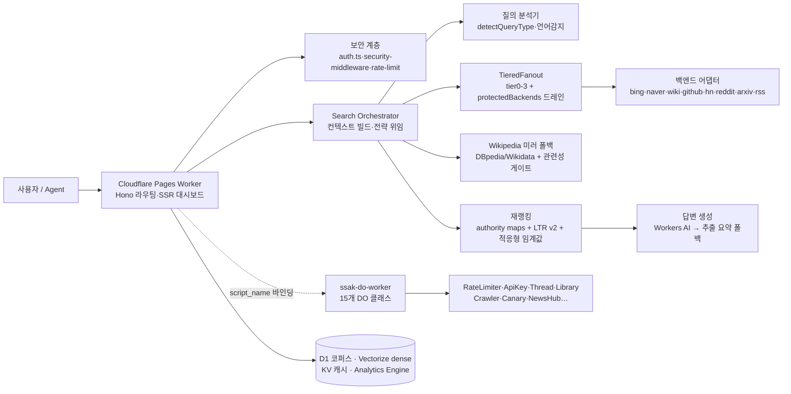

# 03 — 목표 아키텍처 (Target Architecture)

> 작성일: 2026-08-23 | 현 검증된 아키텍처와 진화 목표를 함께 기술. 상세 컴포넌트 사양은 README 파일구조·코드 주석(ADR성) 참조.

## 1. 전체 구성도 (현재 = 검증됨)

## 2. 핵심 흐름·책임

| 흐름 | 경로 | 책임 컴포넌트 |
|---|---|---|
| 검색 | auth → context → fanout → mirror → merge/dedup → rerank → 응답 | orchestrator.ts 총괄 |
| 수집-색인 | cron/수동 → crawler(DO) → 청킹 → 임베딩 → D1/Vectorize | src/lib/index/pipeline.ts |
| 답변 | results → Workers AI 프롬프트 → 추출 요약 폴백 | lib/answer.ts |

## 3. 장애 대응 구조 (실측)

- 백엔드 실패 → circuit breaker(3회/20s) → tier 스킵 → 부분 결과 반환
- wikipedia 부재 → S35 미러 폴백(+관련성 게이트 B-7)
- bing 차단 → naver/ddg/self-index/mirror로 품질 유지(관측됨)
- CPU 예산 초과 → lightweight 모드 자동 전환(cpu_budget 메트릭)

## 4. 보안 경계

- 외부 경계: Pages(HTTPS/CF WAF) → auth.ts(Bearer/X-API-Key, ApiKeyDO 스코어·만료) → 레이트리밋(DO)
- 송신 경계: assertSafeFetchUrl(SSRF 가드), 백엔드별 타임아웃·브레이커
- 감사: AUDIT_SECURITY 구조화 로그 → Logpush/Datadog

## 5. 확장 전략 및 전환 과제 (현 구조 → 목표)

| 영역 | 현재 | 목표 | 전환 방법 |
|---|---|---|---|
| 크롤링 | 단일 CrawlerDO | 분산 크롤러 큐(Queues) | DO→Queues 점진 이관 |
| 랭킹 | LTR v2 로컬 폴백 다수 | full 모드 표준화 | 유료 플랜/AI 바인딩 환경 측정 후 게이트 조정 |
| 평가 | 921쿼리 직접 모드 | 환경 표준화(lightweight/full 분리 리포트) | eval/index.ts에 mode 필드 추가 |
| 멀티테넌시 | TenancyDO 존재 | 테넌트별 쿼터·과금 | API Key 스코어 확장 |
| 지역 | ICN 리전 편중 | 리전 밸런스 | probe-bing-region 기반 라우팅 확장 |

> 원칙 재확인: 유료 검색 API 금지, 자체 호스팅 우선([UNIFIED_ROADMAP.md](../../UNIFIED_ROADMAP.md) 제약 고정)
